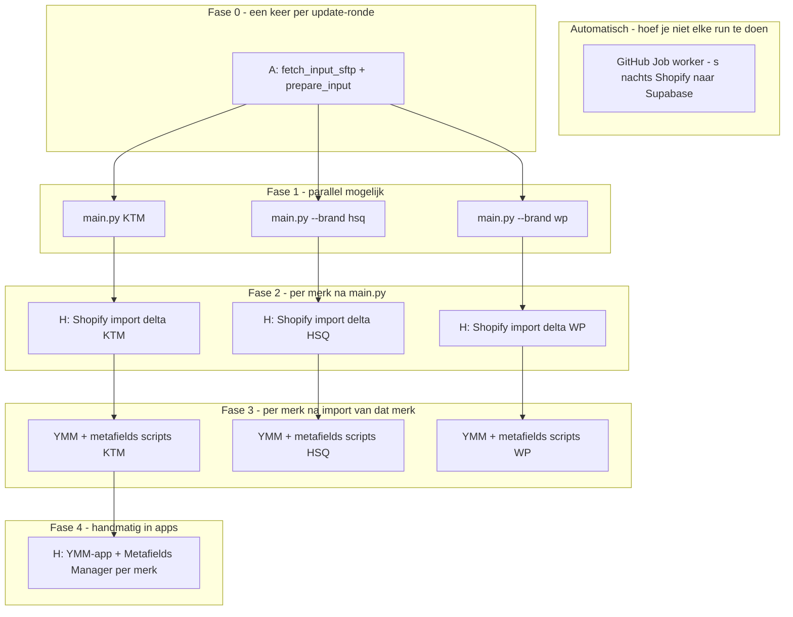

# Workflow per merk (KTM · Husqvarna · WP)

Stappenplan om **regelmatig** nieuwe producten te verwerken: bronbestanden → `main.py` → Shopify-import → YMM + metafields.

Alle commando’s vanaf de **projectroot** (`ktm_project/`). Python: `python3`.

**Snelle commando’s (alle merken):** [`HOWTO.md`](../HOWTO.md)  
**FTP, fouten, ETA-sync:** [`docs/workflow.md`](workflow.md)  
**Alleen nieuwe producten (zonder ETA-API):** [`docs/workflow_nieuwe_producten.txt`](workflow_nieuwe_producten.txt)

---

## Voor je begint

1. Terminal openen in de projectmap (`cd …/ktm_project`).
2. Eenmalig: `.env` met o.a. `SHOPIFY_ACCESS_TOKEN` (zie [`docs/shopify_env.md`](shopify_env.md)).
3. Na elke Shopify-productimport: **wacht tot de import klaar is** voordat je YMM/metafields draait.

**Merk kiezen in `main.py` en scripts:** `--brand ktm` (default), `--brand hsq`, of `--brand wp`  
(Niet `brands` — het is één vlag `--brand` / `-b`.)

---

## Geoptimaliseerd schema (KTM + HSQ + WP)

Legenda: **A** = automatisch · **‖** = mag tegelijk · **→** = moet eerst klaar zijn · **H** = handmatig (jij in browser/apps)



### Wat wanneer?

| Fase | Wat | Type | Parallel? |
|------|-----|------|-----------|
| — | **Job worker** (Supabase-spiegel) | **A** ’s nachts | Los van jouw dag-workflow |
| **0** | FTP → `input/`, `input/hsq/`, `input/wp/` | Script 1× | Daarna fase 1 |
| **1** | `main.py` per merk | Terminal | **‖** 3 terminals tegelijk (zwaar: veel RAM) |
| **2** | Shopify **product**-import (delta-CSV) | **H** Admin | **‖** 3 imports tegelijk *kan*, maar wacht per merk vóór fase 3 |
| **3** | YMM-export → metafields-export | Terminal | **‖** per merk: YMM **dan** metafields (niet omwisselen) · **‖** KTM/HSQ/WP in aparte terminals *na* import van dat merk |
| **4** | YMM-app + Metafields Manager | **H** | Eén app-import tegelijk aanbevolen |
| **5** | KTM: prijs/ETA API (optioneel) | Terminal | Alleen KTM, na nieuwe producten |

### Bronbestanden per merk (fase 0)

| Merk | Map | XML | CSV (prijs) |
|------|-----|-----|-------------|
| **KTM** | `input/` | `CBEXPDN_KTM-DN*.xml` | `0150_35_Z1_EUR_EN_csv.csv` |
| **HSQ** | `input/hsq/` | `CBEXPDN*.xml` | `1100_…` + `0140_…` |
| **WP** | `input/wp/` | `CBEXPDN*.xml` | `0910_35_Z1_EUR_EN_csv.csv` |

*(“civ” = **CSV**.)*

### Fase 0 — één keer ophalen (alle merken)

```bash
cd ~/Documents/ktm_project
python3 scripts/fetch_input_sftp.py
python3 scripts/prepare_input_from_ftp.py --extract-xml-from-zips
```

### Fase 1 — exports genereren (**‖** optioneel: 3 terminal-tabbladen)

```bash
# Tab 1 — KTM
python3 -u main.py

# Tab 2 — HSQ
python3 -u main.py --brand hsq

# Tab 3 — WP
python3 -u main.py --brand wp
```

Noteer per merk het delta-bestand (of):

```bash
ls -t output/products/shopify_export_delta_*.csv | head -1
ls -t output/hsq/products/shopify_export_delta_*.csv | head -1
ls -t output/wp/products/shopify_export_delta_*.csv | head -1
```

### Fase 2 — Shopify product-import (**H**, per merk)

| Merk | Bestand |
|------|---------|
| KTM | `output/products/shopify_export_delta_*.csv` |
| HSQ | `output/hsq/products/shopify_export_delta_*.csv` |
| WP | `output/wp/products/shopify_export_delta_*.csv` |

**Wacht** tot de import van **dat merk** klaar is vóór fase 3 voor dat merk.

### Fase 3 — YMM + metafields (Terminal, per merk)

Vervang `DELTA.csv` door jouw bestand. Volgorde **binnen een merk**: eerst YMM, dan metafields.

**KTM**

```bash
python3 -u scripts/export_product_ids_and_ymm.py --refresh-shopify-cache \
  --delta-handles-csv output/products/shopify_export_delta_JJJJMMDD_HHMMSS.csv
python3 -u scripts/export_product_metafields.py \
  --delta-handles-csv output/products/shopify_export_delta_JJJJMMDD_HHMMSS.csv
```

**HSQ**

```bash
python3 -u scripts/export_product_ids_and_ymm.py --brand hsq --refresh-shopify-cache \
  --delta-handles-csv output/hsq/products/shopify_export_delta_JJJJMMDD_HHMMSS.csv
python3 -u scripts/export_product_metafields.py --brand hsq \
  --delta-handles-csv output/hsq/products/shopify_export_delta_JJJJMMDD_HHMMSS.csv
```

**WP**

```bash
python3 -u scripts/export_product_ids_and_ymm.py --brand wp --refresh-shopify-cache \
  --delta-handles-csv output/wp/products/shopify_export_delta_JJJJMMDD_HHMMSS.csv
python3 -u scripts/export_product_metafields.py --brand wp \
  --delta-handles-csv output/wp/products/shopify_export_delta_JJJJMMDD_HHMMSS.csv
```

**Tip:** `--refresh-shopify-cache` alleen bij de **eerste** merk-export van de dag; daarna bij HSQ/WP weglaten (sneller, zelfde cache).

### Fase 4 — Apps (**H**)

| Merk | YMM-app | Metafields Manager |
|------|---------|-------------------|
| KTM | `output/ymm/ymm_APP_import_DELTA*.csv` | `output/metafields/product_metafields_metafields_manager_delta.csv` |
| HSQ | `output/hsq/ymm/…` | `output/hsq/metafields/product_metafields_metafields_manager_delta.csv` |
| WP | `output/wp/ymm/…` | `output/wp/metafields/…` |

### Snelste dagindeling (aanbevolen)

1. **Ochtend:** fase 0 + fase 1 (parallel `main.py` als je Mac het aankan).  
2. **Tussendoor:** fase 2 — drie Shopify-imports starten; koffie ☕  
3. **Per merk zodra import klaar:** fase 3 in terminal.  
4. **Slot:** fase 4 in apps (één voor één).  
5. **KTM optioneel:** `shopify_refresh_variant_cache.py` + `shopify_sync_from_pricelist_csv.py`.

**Niet doen:** YMM/metafields vóór Shopify-import · metafields vóór YMM-export · `limit: 0` backfill in GitHub (te zwaar; zie [`docs/supabase-ymm-pipeline.md`](supabase-ymm-pipeline.md)).

---

## Bronbestanden ophalen (alle merken)

**Automatisch (FTP/FTPS):**

```bash
python3 scripts/fetch_input_sftp.py
python3 scripts/prepare_input_from_ftp.py --extract-xml-from-zips
```

`prepare_input_from_ftp.py` zet prijs-CSV’s automatisch in de juiste map (zie tabel hieronder). XML in een zip wordt uitgepakt naar de map die je met `--input-dir` kiest (standaard `input/`); voor HSQ/WP kun je XML handmatig in `input/hsq` of `input/wp` zetten, of na extract verplaatsen.

**Handmatig:** zet de bestanden uit de tabel in de genoemde map. Controleer daarna of er precies **één** XML matcht (of zet het pad in `.env`, zie kolom *Override*).

| Merk | Map | XML (glob) | Prijs-CSV (voorkeursnaam) | Fallback glob |
|------|-----|------------|---------------------------|---------------|
| **KTM** | `input/` | `CBEXPDN_KTM-DN*.xml` | `0150_35_Z1_EUR_EN_csv.csv` | `*0150*.csv` |
| **HSQ** | `input/hsq/` | `CBEXPDN*.xml` (bv. `CBEXPDN_HQV-DN-….xml`) | `1100_35_Z1_EUR_EN_csv.csv` + `0140_35_Z1_EUR_EN_csv.csv` (0140 wint bij dubbele SKU) | `*1100*.csv`, `*0140*.csv` |
| **WP** | `input/wp/` | `CBEXPDN*.xml` (bv. `CBEXPDN_WP-DN-….xml`) | `0910_35_Z1_EUR_EN_csv.csv` | `*0910*.csv` |

Optioneel voor alle merken: productafbeeldingen onder `input/` (recursief op bestandsnaam). HSQ/WP gebruiken ook afbeeldingen uit de gedeelde `input/` (KTM-map).

**.env override (optioneel):** `KTM_XML_FILE`, `HSQ_XML_FILE`, `WP_XML_FILE` · `KTM_0150_CSV`, `HSQ_PRICE_CSV`, `WP_PRICE_CSV`

---

## KTM — checklist

### 1. Databestanden in `input/`

- [ ] XML: `CBEXPDN_KTM-DN*.xml`
- [ ] Prijs: `0150_35_Z1_EUR_EN_csv.csv` (of ander `*0150*.csv`)
- [ ] Optioneel: afbeeldingen in `input/`

### 2. Product-CSV genereren

```bash
python3 -u main.py
```

Of expliciet: `python3 -u main.py --brand ktm`

**Output (noteer het bestand met timestamp):**

- Delta (meestal importeren): `output/products/shopify_export_delta_JJJJMMDD_HHMMSS.csv`
- Volledig: `output/products/shopify_export_all_JJJJMMDD_HHMMSS.csv`

Laatste delta vinden:

```bash
ls -t output/products/shopify_export_delta_*.csv | head -1
```

### 3. Shopify — producten importeren

**Shopify Admin → Products → Import** met de **delta-CSV** uit stap 2. Wacht tot de import klaar is.

### 4. YMM + metafields (Terminal)

Vervang `JJJJMMDD_HHMMSS` door de timestamp van **jouw** delta-run.

```bash
python3 -u scripts/export_product_ids_and_ymm.py --refresh-shopify-cache \
  --delta-handles-csv output/products/shopify_export_delta_JJJJMMDD_HHMMSS.csv

python3 -u scripts/export_product_metafields.py \
  --delta-handles-csv output/products/shopify_export_delta_JJJJMMDD_HHMMSS.csv
```

### 5. Apps uploaden

| App | Bestand(en) |
|-----|-------------|
| **YMM-app** | `output/ymm/ymm_APP_import_DELTA*.csv` (eventueel `_part_00x`) |
| **Metafields Manager** | `output/metafields/product_metafields_metafields_manager_delta.csv` |

**Alternatief** (alleen filteren, geen nieuwe generatie):  
`python3 scripts/export_delta_app_imports.py` → o.a. `output/ymm/ymm_APP_import_delta_latest.csv`

### 6. Optioneel — prijzen / ETA / voorraadbeleid via API (KTM)

Na **nieuwe** producten in Shopify:

```bash
python3 scripts/shopify_refresh_variant_cache.py
python3 scripts/shopify_sync_from_pricelist_csv.py
```

Zie [`HOWTO.md`](../HOWTO.md) en [`docs/workflow.md`](workflow.md) §3b.

---

## Husqvarna (HSQ) — checklist

### 1. Databestanden in `input/hsq/`

- [ ] XML: `CBEXPDN*.xml` (Husqvarna-export)
- [ ] Prijs: `1100_35_Z1_EUR_EN_csv.csv` en `0140_35_Z1_EUR_EN_csv.csv`
- [ ] Optioneel: afbeeldingen (`input/hsq/` en/of gedeelde `input/`)

### 2. Product-CSV genereren

```bash
python3 -u main.py --brand hsq
```

**Output:**

- Delta: `output/hsq/products/shopify_export_delta_JJJJMMDD_HHMMSS.csv`

```bash
ls -t output/hsq/products/shopify_export_delta_*.csv | head -1
```

### 3. Shopify — producten importeren

Importeer de delta-CSV uit `output/hsq/products/`. Handles hebben prefix `hsq-`.

### 4. YMM + metafields

```bash
python3 -u scripts/export_product_ids_and_ymm.py --brand hsq --refresh-shopify-cache \
  --delta-handles-csv output/hsq/products/shopify_export_delta_JJJJMMDD_HHMMSS.csv

python3 -u scripts/export_product_metafields.py --brand hsq \
  --delta-handles-csv output/hsq/products/shopify_export_delta_JJJJMMDD_HHMMSS.csv
```

### 5. Apps uploaden

| App | Map |
|-----|-----|
| **YMM-app** | `output/hsq/ymm/` |
| **Metafields Manager** | `output/hsq/metafields/product_metafields_metafields_manager_delta.csv` |

Compact filter: `python3 scripts/export_delta_app_imports.py --brand hsq`

---

## WP — checklist

### 1. Databestanden in `input/wp/`

- [ ] XML: `CBEXPDN*.xml` (WP-export)
- [ ] Prijs: `0910_35_Z1_EUR_EN_csv.csv` (of `*0910*.csv`)
- [ ] Optioneel: afbeeldingen (`input/wp/` en/of gedeelde `input/`)

### 2. Product-CSV genereren

```bash
python3 -u main.py --brand wp
```

**Output:**

- Delta: `output/wp/products/shopify_export_delta_JJJJMMDD_HHMMSS.csv`

```bash
ls -t output/wp/products/shopify_export_delta_*.csv | head -1
```

### 3. Shopify — producten importeren

Importeer de delta-CSV uit `output/wp/products/`. Handles hebben prefix `wp-`.

### 4. YMM + metafields

```bash
python3 -u scripts/export_product_ids_and_ymm.py --brand wp --refresh-shopify-cache \
  --delta-handles-csv output/wp/products/shopify_export_delta_JJJJMMDD_HHMMSS.csv

python3 -u scripts/export_product_metafields.py --brand wp \
  --delta-handles-csv output/wp/products/shopify_export_delta_JJJJMMDD_HHMMSS.csv
```

### 5. Apps uploaden

| App | Map |
|-----|-----|
| **YMM-app** | `output/wp/ymm/` |
| **Metafields Manager** | `output/wp/metafields/product_metafields_metafields_manager_delta.csv` |

Compact filter: `python3 scripts/export_delta_app_imports.py --brand wp`

---

## Volgorde in één oogopslag

```text
Bronbestanden (input/<merk>/)  →  main.py [--brand …]  →  Shopify delta-import
       →  export_product_ids_and_ymm.py  →  export_product_metafields.py
       →  YMM-app + Metafields Manager
```

| Stap | KTM | HSQ | WP |
|------|-----|-----|-----|
| Inputmap | `input/` | `input/hsq/` | `input/wp/` |
| `main.py` | `python3 -u main.py` | `… --brand hsq` | `… --brand wp` |
| Delta-CSV | `output/products/shopify_export_delta_*.csv` | `output/hsq/products/…` | `output/wp/products/…` |
| YMM/metafields | zonder `--brand` (default ktm) | `--brand hsq` | `--brand wp` |
| YMM-output | `output/ymm/` | `output/hsq/ymm/` | `output/wp/ymm/` |
| Metafields-output | `output/metafields/` | `output/hsq/metafields/` | `output/wp/metafields/` |

---

## Hele catalogus (zeldzaam)

Alleen als je bewust alles opnieuw wilt syncen — grote bestanden, meer kans op time-outs in apps:

```bash
python3 -u scripts/export_product_ids_and_ymm.py --brand hsq
python3 -u scripts/export_product_metafields.py --brand hsq
```

Details: [`docs/metafields_manager_export.md`](metafields_manager_export.md).

---

## Veelvoorkomende fouten

| Probleem | Oplossing |
|----------|-----------|
| `0150` / prijsbestand niet gevonden | Juiste CSV in de **merk-map** (zie tabel boven) |
| Verkeerde of oude XML | Eén duidelijke XML in de map; anders `KTM_XML_FILE` / `HSQ_XML_FILE` / `WP_XML_FILE` in `.env` |
| YMM vindt geen product-id’s na import | `--refresh-shopify-cache` op `export_product_ids_and_ymm.py` |
| Time-out in YMM-/metafields-app | Delta-flow met `--delta-handles-csv`, niet de volledige catalogus |
| `main.py brands hsq` werkt niet | Gebruik `--brand hsq` (met dubbele streepje) |

Log bij falende ETL: `output/logs/<merk>_etl_<timestamp>.log` — zie [`docs/workflow.md`](workflow.md).
